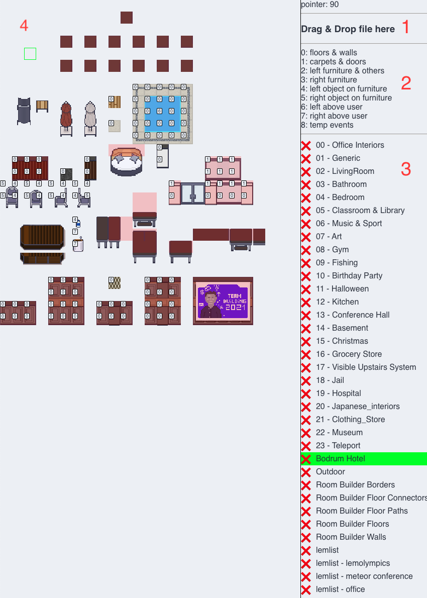
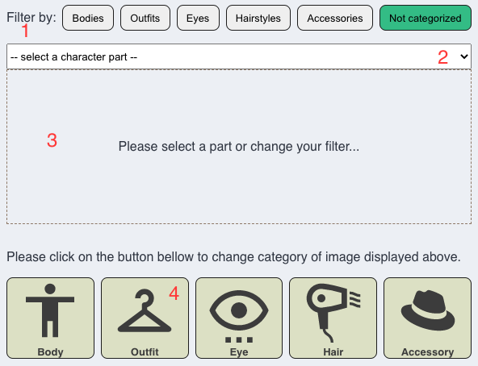
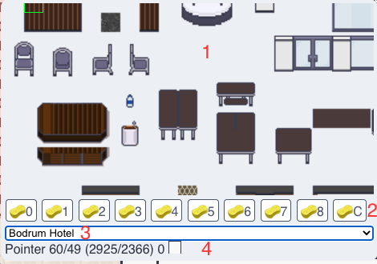
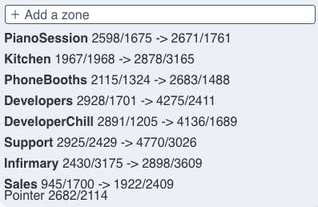
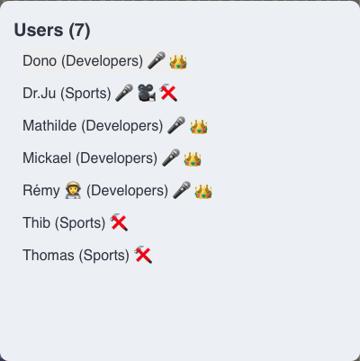
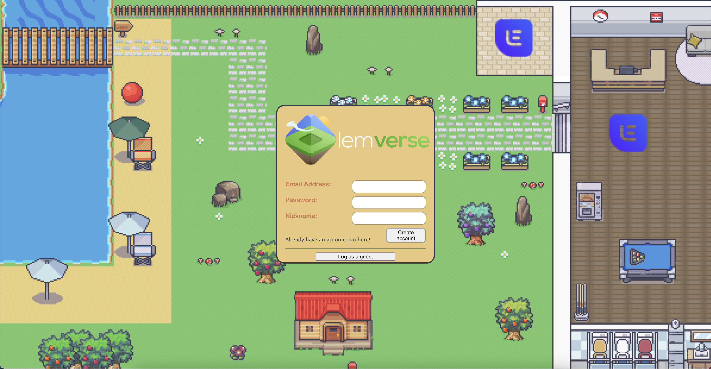
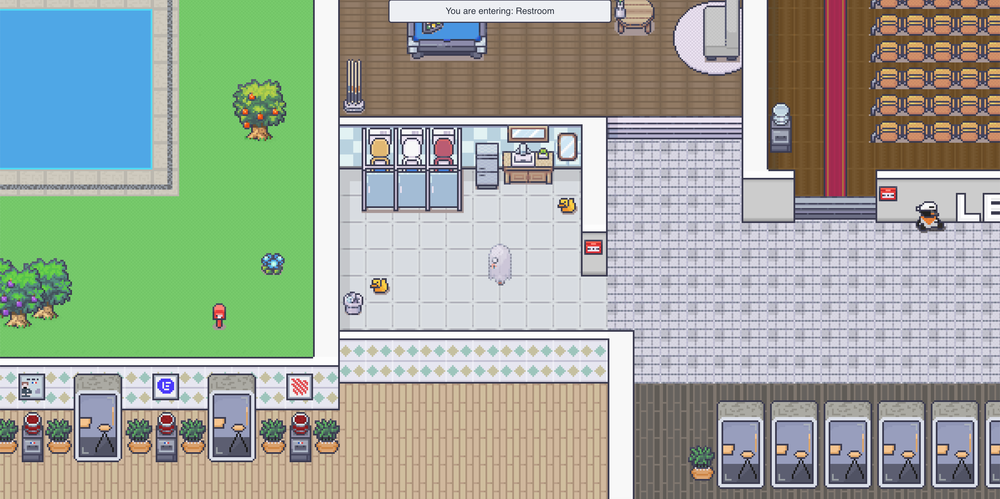
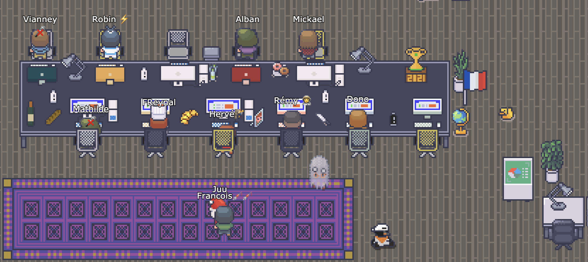

<p align="center">
    
</p>

# Table of contents
- [What is `lemverse`?](#what-is--lemverse--)
- [What can I do in lemverse?](#what-can-i-do-in-lemverse-)
- [Getting started!](#getting-started-)
- [Deploy in production!](#deploy-in-production-)
- [Useful commands/tricks](#useful-commands-tricks)
- [Assets](#assets)
- [License](#license)
- [Credits](#credits)
- [Screenshots](#screenshots)

# What is `lemverse`?

- Want to talk with your remote colleagues/friends?
- Want to have the office you have ever dreamt of?
- Want to friendly get in touch with people without messaging them?
- Want to hold virtual conference?
- Want to walk inside your own coworking office? 
- Want to try something new?

If you have answer `yes` to one of those questions, then `lemverse` is for you!  
You can either launch it locally, on a server or join us at [lemverse.com](https://lemverse.com).

> ℹ️ Can't wait to install lemverse? You can go directly to the [Getting started](#getting-started) section  
> :warning: For the moment we only focus on compatibility with the Chrome browser  

# What can I do in lemverse?

## Tileset Editor

In order to be able to create your own universe, you will need some tilesets.  
We recommend using tileset of 16x16 pixels.

To upload a new tileset, visit the url `http://localhost:9000/editor` or `http://lemverse.example.com/editor`.  
ℹ️  Only people with `admin` role can access this page.

Here are the description of all parts:  


1) As stated, you drag and drop your image file(s) to upload them.
2) This part is just a reminder about the index of the layers for all tiles.
   - Player are between layer `5` and `6`.
   - Default index is `2` and not displayed.
3) This is the list of all tilesets.
   - You can either remove the tileset with hitting the cross
   - Rename it, by double clicking on it
4) The view of the tileset
   - When you are over a tile, simply hit a number from `0` to `8` to change the layer
   - Layer `2` is the default and thus is not displayed
   - Hit `c` to change the tile to be a collision tile (will be displayed in red)


Once you have imported the tileset and do some tweak about collision and layering, you can begin to create your universe!

## Character Editor

This editor takes place at the same place as the tilesets editor.

To add a new resource, simply drag & drop over the page.

Here are the description of all parts:  


1) Different type of filter to change the dropdown
2) Here are the list of all resources available in the current category
3) Display of the character part to help you figure out how to categorize it.
4) The five possible categories to change the part.

## Edit your universe!

For editing the universe you need to have the right to do so. Luckily for you, outside of production anybody can do it!

To move to the editor mode, simply it `e` and you should see it!
### Level edit

Once you hit `e` you will see something like this:  


Here are the description of all parts:  
1. All tiles that you can select. Move your mouse over them and click to select.
   - Once it's done, you can click on the map to paste it.
   - You can also select multiple tiles at the same time!
2. You did mess up and want to clean up things?
   - You can hit `cmd+z` to undo what you just did.
   - Or use the `eraser` tool to remove one layer (shortcut from `0` to `8`) or hit `c` to remove all layers upon selection.
3. It's the dropdown of all your tilesets. You can select another one to be able to copy/paste others tiles.
4. Information about your current pointer on map.
   - You have the position
   - Information about the different tiles on each layers (useful to use the right `eraser` layer)

### Zone edit

Once you hit `e` again you will see something like this:  


You can add a zone then select on the map the top left followed by the bottom right corner of the new zone.

If you want to edit a zone, simply click on either corner coordinate then click on the map.

> ℹ️ Press "alt" or "option" during edition to snap world coordinates to tiles coordinates

Each zone can be configured to make more things.  
To edit those information, simply click on the name of the room (bold text).

```jsonc
{
  "adminOnly": "", // Put true to restrict the zone
  "levelId": "lvl_iLOVEaLOTlemverse", // LevelId of the zone
  "name": "PianoSession", // Name displayed when you enter in the zone
  "roomName": "", // Useful for jitsi server
  "teleportEndpoint": "", // Coordinate "640,480" where unauthorized people will be teleported once enter restricted zone
  "unmute": "", // Automatically unmute jitsi mic (useful to unmute people on platform in conference room)
  "url": "https://mczak.com/code/piano/pianoframe", // If present, this will popup an iframe with this url inside
  "unhide": "", // Automatically show cam in jitsi (useful to show people face automatically on platform in conference room)
  "fullscreen": false, // Set the iframe if full screen or not
  "targetedLevelId": "", // Used for teleport zone. Should be the id of the level to teleport to.,
  "inlineURL": "https://status.lemlist.com|<p>My custom text</p>", // Create a pop-in with URL or HTML content
  "disableCommunications": false, // Disabling communications for the user inside
  "popInConfiguration": {
    "position": "top", // Optional: Pop-in position on the zone (center, left, right, bottom or top), set "relative" for custom position using "x" & "y" (default center)
    "x": 0, // Optional: Relative position from the zone's center on X (you need to set "position" to "relative")
    "y": -60, // Optional: Relative position from the zone's center on Y (you need to set "position" to "relative")
    "width": 120, // Optional: Custom width
    "height": 45, // Optional: Custom height
    "className": "wood welcome" // Optional: List of CSS classes to customize pop-in's style
  }
}
```
### Edit spawn position

To help you setting up the spawn position, you simply have to walk where your want your `explorers` to spawn and execute the following command:  
```js
remote(`setSpawnLevelXY()`)
```

This command is reserved for `god` only, and will update the spawn position of the current level you are in.

## Shortcuts in lemverse

In lemverse you have only few but useful shortcuts!  

### Who's here and where?

What to know more about the `explorers` in the same universe?  
Hit `Tab` and you will see them! And maybe ghosts...



Only `admin` can see others admin (with the 👑).  
You can allow other users to edit your universe by clicking on the hammer and spanner 🛠.
### Reactions

If you want to use pre-defined reactions, you can hit from `1` to `5` and it will display an emoji on top of your character.  
If you want to use a custom one, go to the settings to add one, and use `l` to activate it!

### Share what you want!

Activating camera, sharing screen can be annoying with the mouse itself, so simply use `shift`+`1` (to `4`) to switch the state of the options.

### Editing the level

Like describe in a previous part, we must use `e` to launch the edit mode.

### Shout to your surrounding!

Like in real life, you can shout around you.  
We restricted this to the zone you are currently in.

To do so, simply hit `r` and speak!  
Once you finished, just release the touch and your message will be send to everybody and play instantly.

### Leave a message!

It may happen that a user isn't available to chat. Fortunately, it's possible to leave a message for the user.

The use is very simple, you just have to go near the person to whom you want to leave a message and then press the `p` key, speak and release the key.

The user will then receive a notification.
You can also open your notification list and listen to old messages using `cmd/ctrl + 5`.


## How to create a new universe?

To create a new universe you need to add a document in the `levels` collection.

Simply run the following command in your browser console:  
```js
Levels.insert({_id: Levels.id(), name: "My test universe"})
```

For the `level` structure, here are an explanation of all fields:
```jsonc
{
    _id: "lvl_XXXXXXXX", // Id of the level (useful for TP)
    name: "My test universe", // Name of your universe
    spawn: { // Spawn position in level
        x: 42,
        y: 7
    },
    skins: {
        guest: { // Guest Avatar
            body: "chr_11111111111111111", // Id "characters" collection
            accessory: "chr_22222222222222222", // Id in "characters" collection (Optional)
            hair: "chr_33333333333333333", // Id in "characters" collection
            eye: "chr_44444444444444444", // Id in "characters" collection
            outfit: "chr_55555555555555555" // Id in "characters" collection
        },
        default: { // Default Avatar when user create account
            body: "chr_11111111111111111", // Id "characters" collection
            accessory: "chr_22222222222222222", // Id in "characters" collection (Optional)
            hair: "chr_33333333333333333", // Id in "characters" collection
            eye: "chr_44444444444444444", // Id in "characters" collection
            outfit: "chr_55555555555555555" // Id in "characters" collection
        }
    }
}
```

You can use the level id everywhere it's useful, like in the `defaultLevelId` property in `settings.json` (More information bellow).

## Tell me more about `settings.json`!

This file regroup all information about the settings.  
Please note, that as stated in section `Deploy in production`, there is an additional file with sensitive information that will me merge with the one in the repository.

ℹ️  It's better to copy the file `_settings.json` available in the app folder instead of copying the excerpt below
<details>
  <summary>Click to toggle contents of _settings.json</summary>
  <p>

  ```jsonc
  {
    "public": {
      "lp": {
        "product": "lemverse",
        "process": "main",
        "gods": [], // List of gods (can use remote command) like "usr_11111111111111111"
        "production": true,
        "staging": false,
        "enableLogClient": false
      },

      "debug": false,

      "defaultReaction" : "❤️",

      "zoom": 1,

      "peer": { // Settings about webrtc connection
        "answerMaxAttempt": 5,
        "answerDelayBetweenAttempt": 750,
        "avatarAPI": "https://source.unsplash.com/320x240/?cat&sig=[user_id]", // Avatar when users do not share their camera
        "callDelay": 250, // Delay before a call is started, useful to avoid a call when you pass by someone
        "delayBeforeClosingCall": 1000
      },

      "meet": { // Jitsi settings
        "serverURL": "meet.jit.si",
        "roomDefaultName": "lemverse"
      },

      "character": { // Settings to handle velocity of the character
        "walkSpeed": 180,
        "runSpeed": 720
      },

      "characterNames": ["Basic", "Ghost"], // List of in repository characters (should not change since you can upload new ones)

      "skins": {  // Default skins (can be defined at level)
        "guest": "Ghost", // Simple format
        "guest": { // Layered format
          "body": "chr_H2ARGyiKd8wQ4hQcr"
        },
        "default": "Basic"
      }
    },

    "defaultLevelId": "lvl_iLOVEaLOTlemverse", // Default level Id created at first run.

    "peer": {
      "path": "/peer",
      "client": {
        "url": "peer.example.com",
        "port": 443,
        "secret": "******", // Required for turn server support
        "credentialDuration": 86400,
        "config": {
          "iceServers": [{
            "urls": "stun:stun.l.google.com:19302"
          }],
          "iceTransportPolicy" : "all",
          "sdpSemantics": "unified-plan"
        }
      },
      // Details about the configuration bellow is available here: https://github.com/peers/peerjs-server#config--cli-options
      "server": {
        "port": 7010,
        "key": "peerjs",
        "alive_timeout": 60000,
        "expire_timeout": 5000,
        "allow_discovery": false,
      }
    }
  }
```
</p>
</details>

# Getting started!

Once you have cloned the repo, launch `./init` and wait, that's all!

Due to image manipulation, please read [GraphicsMagick & ImageMagick](https://www.npmjs.com/package/gm) to install any additional library.

Launch `./run` to run the app, accessible at `http://localhost:9000`.  
The mongodb database is accessible at `http://localhost:9001`.

## LocalTunnel to debug with other computers

Webrtc is working when on localhost, but if you want to test with another computer you need to have an HTTPS connection.  
You will need to use a tunnel to expose you laptop over internet.  

We decided to use [localtunnel](https://github.com/localtunnel/localtunnel).  
Once it's installed on an accessible server, setup env variable `LT_DOMAIN` without http(s) so just the domain.

After that, simply launch `run-lt`.

Modify `createMyPeer` in `peer.js` to change the host to `lemverse-peer-USER-DOMAIN` while `USER`=`whoami` and `DOMAIN`=`LT_DOMAIN` env variable.

Access to your local instance at: `https://lemverse-USER-DOMAIN`.

> :warning: Don't forget to change the port to 443 for peers when using local tunnel

## First login

Simply create your account and voila!  
You now have a nice player with everything is black!

Since you are not admin, you can not change anything 😭.  
Let's change that!

Execute this command and you should become admin:
```js
remote(`Meteor.users.update(Meteor.userId(), { $set: { roles: { admin: true } }})`)
```

Now enjoy the possibility to edit by simply pressing `E` on you keyboard (see more detail below).

ℹ️ In production, to execute the `remote` command you need to add yourself (`Meteor.userId()`) in the admin array in `settings.json` (something like `usr_XXXXXX`) or hide it in the `/usr/local/etc/lemverse.json` (Server side only!).

## Roles

In lemverse you have different roles:
- `Guest`: Can move everywhere but can not talk, share screen nor listen
- `User`: Can move everywhere except admin zone (`adminOnly=true`), talk, listen, share screen
- `Editor`: Same as `User` but can also edit the level
- `Admin`: Same as `Editor` (for all levels) but can go to every zones and give people `Editor` roles (Through UI)
- `God`: Same as `Admin` but can also run `remote` command from the console

# Deploy in production!

## Initial setup

To enable the usage of conference room, you will need to install [JITSI](https://jitsi.org/downloads/) on the server.

lemverse is using `MUP` to deploy application **that requires the root access**.  
Prior to the setup, still on the server, please create the following folder using `mkdir -p /opt/lemverse/tmp`.

For manipulating images, we are using [gm](https://www.npmjs.com/package/gm); please follow the setup in the package documentation.  
It should looks like `sudo apt-get install graphicsmagick`.

Now we need to configure the deployment. Please have a look to `mup.json` in the app folder and do the changes.  
You can set `setupMongo` or `setupNode` to `true` if you want `MUP` to setup mongo or add the right nodejs version on server.  
ℹ️ Please note, that `mup` can only be used with `root` access.

It's necessary to have a replica set active on your Mongo instance (see the mup.json file), add the following lines to the `/etc/mongod.conf` file to activate it:
```
replication:
  replSetName: rs0
```

Restart the Mongo service using `systemctl restart mongod` and initiate the replica set using `rs.initiate()` from the mongo shell.

If you do have some sensitive information, you can copy the file `settings.json` and paste it on the server at `/usr/local/etc/lemverse.json` (Server side only).  
At the startup of the application, those settings will be merged with the current ones.

After those preparation steps, run `./setup` in `app` folder from your workstation.

## Nginx configuration example

Since the app is exposed on port `9000` you might want to expose as domain without specifying the port.

Below is an example of a possible nginx config file:

```nginx
# we're in the http context here
map $http_upgrade $connection_upgrade {
    default upgrade;
    ''      close;
}

server {
    server_name lemverse.example.com;

    client_max_body_size 20M;
    access_log /var/log/nginx/access_lemverse.log;
    error_log /var/log/nginx/error_lemverse.log;

    location / {
        proxy_pass http://localhost:9000;
        proxy_http_version 1.1;
        proxy_set_header Upgrade $http_upgrade; # allow websockets
        proxy_set_header Connection $connection_upgrade;
        proxy_set_header X-Forwarded-For $remote_addr; # preserve client IP
        proxy_set_header Host $host;  # pass the host header - http://wiki.nginx.org/HttpProxyModule#proxy_pass
    }

    listen 443 ssl; # managed by Certbot
    ssl_certificate /etc/letsencrypt/live/app.lemverse.com/fullchain.pem; # managed by Certbot
    ssl_certificate_key /etc/letsencrypt/live/app.lemverse.com/privkey.pem; # managed by Certbot
    include /etc/letsencrypt/options-ssl-nginx.conf; # managed by Certbot
    ssl_dhparam /etc/letsencrypt/ssl-dhparams.pem; # managed by Certbot
}

server {
    if ($host = lemverse.example.com) {
        return 301 https://$host$request_uri;
    } # managed by Certbot


    server_name lemverse.example.com;
    listen 80;
    return 404; # managed by Certbot
}
```
## Other deployments

Once you have done it, the subsequent deployments will be done using the command `./deploy`.

## Docker images

### Official image

The official lemverse image is `lempire/lemverse`.  
If you want to pull the last version, you should do:  
`docker pull lempire/lemverse:latest`


### Build
#### Production

To build the latest version of lemverse, simply run the following command:  
`docker build . -t lempire/lemverse:latest`

#### Development

To build from you source without having to install anything, you can run the following command:

`docker build -f Dockerfile.dev . -t lempire/lemverse:dev`

## Slack Notification upon deployment

To have a slack notification, you need to install the [slack cli](https://github.com/rockymadden/slack-cli) on the workstation from which you will deploy.

You should also have an environment variable `LEMVERSE_CHANNEL` 

# Useful commands/tricks

## Beta flag

If you want to add feature either not completely finished or just to test for few users, you should use `beta flags`.

To use the beta flag, you have one function `isLemverseBeta` which can be called either in `.hbs` file as is or in `.js` with `lp.isLemverseBeta('myBetaFlag')`.

The beta flag are stored in an array named `beta` inside each document in `users` collection.
## Maintenance aka Import/Export data

### Export

Since the data is stored in mongo database, you can simply use the command:

```bash
mongoexport --db lemverse --collection=tilesets --jsonArray --out lemverse-tilesets.json
```

### Import

To import a saved collection, use the following command to import it:

```bash
mongoimport --db=lemverse --collection=tilesets --host=localhost --port=9001 --file=./lemverse-tilesets.json --drop --jsonArray
```

The command will replace the current `tilesets` collection with the data inside the file.

## `remote` command

Within your browser, you can safely (`god` only) execute command in your backend.

We provide a command named `remote` that will pass the content to the backend to be executed with `eval`.

For example, to add a beta flag to yourself execute this command in your browser:
```js
remote("Meteor.users.update({ _id: Meteor.userId() }, { $addToSet: { 'beta': { $each: ['myAwesomeFeature'] } } });")
```

## Custom avatars

It's possible to modify the avatars displayed during a discussion using an image API. To do so, you just have to modify the `settings.json` file.

You can add dynamic parameters to your URL using `[user_id]` or `[user_name]` to access id and name of the user who requests an avatar.

Website with images API :
- [Unsplash](https://source.unsplash.com)
- [Robohash](https://robohash.org)

> Example with Robohash: `https://robohash.org/[user_name]?set=set4&bgset=bg2&size=320x240`

# Assets

We use paid assets from [limezu](https://limezu.itch.io/) on [itch.io](https://limezu.itch.io/moderninteriors) in the *version 35*. Please keep in mind than lemverse doesn't support the new character format for the moment.

# License

AGPLv3

# Credits

* [Meteor](https://www.meteor.com/)
* [Meteor Up](http://meteor-up.com/)
* [Phaser](https://phaser.io/)
* [Material Design Icons](https://materialdesignicons.com/) for their icons
* [Everybody who contribute on it](https://github.com/l3mpire/lemverse/graphs/contributors)!

# Screenshots

  
  
  
